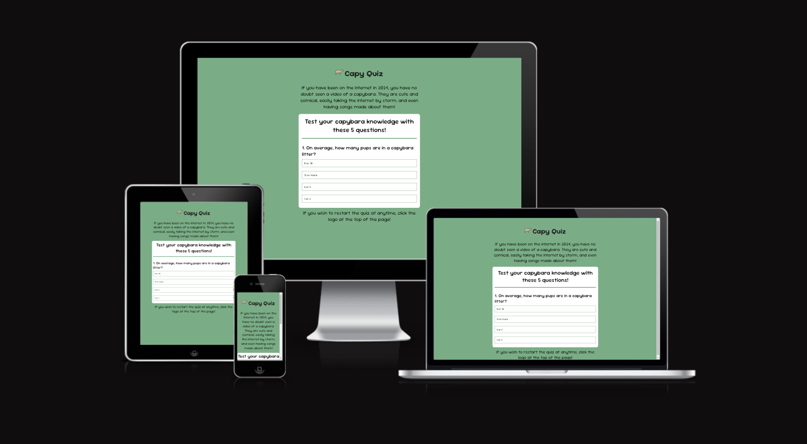
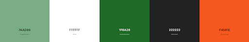
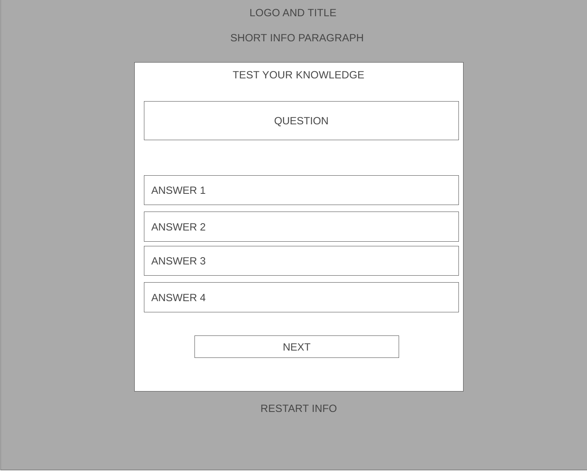
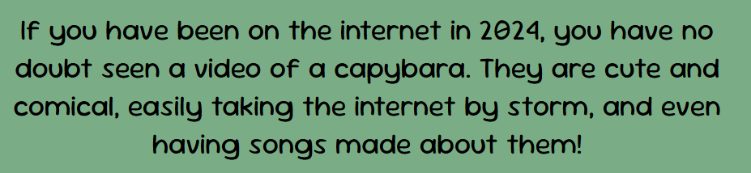
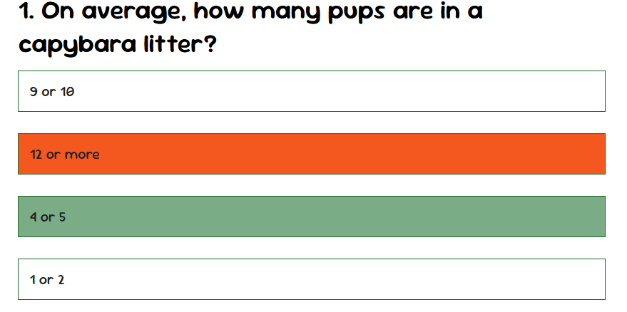
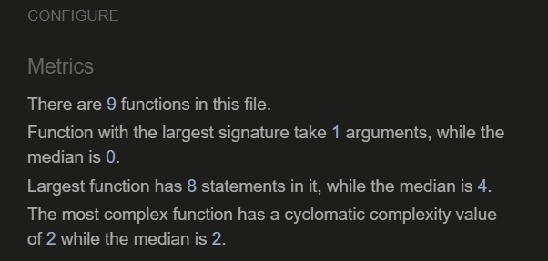
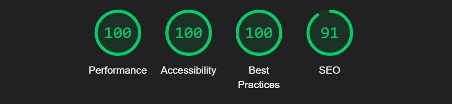
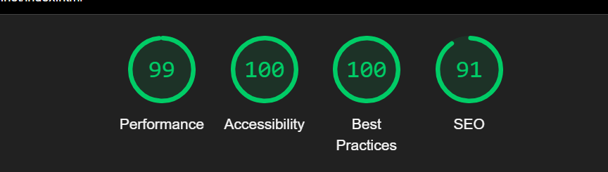
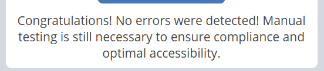

# Capy Quiz

Capy Quiz is a quiz app website that aims to allow users to test their trivia knowledge about capybaras. The site is intended to quiz users with 5 multiple choice questions covering different facts about capybaras.

Capy Quiz includes rotating questions, as well as 4 buttons the user can interact with to choose their answer. Once the user has completed the quiz, their score is displayed, as well as a prompt to restart the game.

The live link can be found here - [Capy Quiz](https://kayla-exe.github.io/capy-quiz/)

## Site Owner Goals
- To provide the user a casual, comfy experience to challenge their capybara knowledge.
- To maintain user engagement with an interactive experience throughout the entire quiz app.
- To entice the user to return to the quiz app to improve their score.

## User Stories
- ### First Time User
  - As a first time user I want the quiz to be informative, accurate and engaging.
  - As a first time user I want a clear visual of when I select the correct answer, or when I select the incorrect answer; for the site to show me which answer was correct.
  - As a first time user I want to be able to see my score at the end of the quiz, and also restart the quiz with my new knowledge and increase my score.

- ### Returning User
  - As a returning user I want to be able to retake the quiz infinitely until I finally get a perfect score.

## Design

### Imagery
The imagery and graphics used were both given careful considering to ensure they compliment the entire 'feel' of the quiz app. A simple cartoon style was used to give a playful, carefree feel
to the site. A simple capybara icon was choosen for the favicon, and casual icons and graphics of capybaras were used throughout.

### Color Scheme
  

- The color scheme of the site was chosen to not only not strain the user's eyes, but also to tie in with the nature of the quiz.
- The decision to make the full background of webpage light green was to increase user accesibility. Too many bright whites against stark dark colors can easily strain the user's eyes, and
  would make the user less likely to return.
- The quiz app area was kept simple and clean, with thematic dark green buttons. It allowed the information to be displayed clearly, while also keeping in theme.

### Fonts
The Sour Gummy font was chosen to be used throughout the entire website. This font was imported from ((GOOGLE FONTS)). Sour Gummy is a playful font, again tying in to the casual, comfy feel of 
the website. Sans serif was selected as a backup in case, for any reason, the main font would not display clearly.

### Wireframe
Wireframe was produced using Wireframe.cc

## Features
- ### Logo and Title
    - The landing page of the website has a very simple layout which includes a H1 heading stating the name of the quiz, as well a simple capybara graphic. The logo and/or the title can be clicked at anytime
      to bring the user back to the start of the quiz, making sure they don't get 'stuck' having to complete the quiz.
  
  

- ### Short Introduction Information
    - Beneath the title, there is a short paragraph giving the user some small information about capybaras and how they 'took the internet by storm'. A decision was made not to include facts, or educational
      information in case any hints were given to some of the questions in the quiz itself.

  

- ### Answer Buttons
    - The multiple choice answers are placed in 4 interactive buttons for the user to select. As the user hovers a button, their cursor becomes a 'pointer', easily conveying that these buttons are able to clicked
      and interacted with. Once one of the buttons is clicked, another button cannot be pressed. This is to disallow the user from changing their answer, and potentially 'cheating'.

  

- ### Next Button
    - The user proceeds to the next question (or score screen) by clicking on the 'Next' button. The next button has a display of 'none' until an answer is selected. This stops the user from being able to jump to
      the next question without inputting an answer. When the user hovers the 'Next' button, the cursor becomes a 'pointer'. Once the user has completed all 5 questions, the 'Next' button's InnerHTML changes to 
      'Try Again' which will reroute the user back to the start of the quiz and also reset their score.

- ### Score
    - Once the user has completed the quiz, their score is displayed. {score} was used, allowing the Javascript to adjust the figure to each individual's final score. Even though there are only 5 question as of 
      right now, {questionlength} was used to allow a future developer to add additional questions and have the Javascript adapt without needing any changing.
 

### Features Left to Implrement
  - A constant counting display of score
  - A leaderboard using local storage and username input

## Testing

### Validator Testing
- ### HTML 
    - No errors or warnings when put through the official HTML Validator.
      [W3C Validator Results](https://validator.w3.org/nu/?doc=https%3A%2F%2Fkayla-exe.github.io%2Fcapy-quiz%2F)

- ### CSS
    - No errors or warnings when put through the official CSS Validator.
      [W3C CSS Validator Results](https://jigsaw.w3.org/css-validator/validator?uri=https%3A%2F%2Fkayla-exe.github.io%2Fcapy-quiz%2F&profile=css3svg&usermedium=all&warning=1&vextwarning=&lang=en)

- ### Javascript
    - No errors or warnings when put through the JSHint Validator

### Accessibility
  - The site achieved a Lighthouse accessibility score of near 100% on both mobile and desktop which confirms that the colours and fonts chosen are easy to read and accessible
  - The website wave.webaim was also used to make sure Capy Quiz was accessible to those with disabilities

### Desktop Lighthouse Score

### Mobile Lighthouse Score

### Wave Score

### Button Testing
  - Each button was tested manually to ensure the user is able to jump to the next question, and select only one answer per question and confirming that all functions run as 
    needed.

### Game Testing
  - The game was tested by tech-savvy friends and family to ensure everything ran as intended, which include but are not limited to:
      - 'Answer' buttons changed color to indicate correct/incorrect answer was selected.
      - 'Next' button remained invisible until an answer was selected.
      - The user's final score was correct.
      - The user was able to restart the quiz once it was completed.

### Browser Testing
  - The quiz app website was tested in Google Chrome, Mozilla Firefox, Safari and Microsoft Edge browsers with no errors or issues noted.

### Device Testing
  - The website was tested on multiple devices including Desktop, Laptop, iPad, iPhone SE and Galaxy Z Fold 5. In both landscape and portrait mode, the website maintained it's
    responsiveness, working as intended. Chrome Dev Tools were also used to allow the website to be tested on a multitude of other dimensions.
  - The following website was also used to test responsiveness and to ensure media queries worked as intended ((RESPONSINATOR))

## Fixed Bugs
### Placing Answers in Buttons
  - When creating the base HTML, I had originally added 4 buttons to which the plan was to place the answers to each question within.
  - While theorycrafting by trying different methods of attaching the different answers of the different questions to each button, I was having difficulty in not only placing
    the answer.text inside those 4 buttons within my index.html, I also struggled for the answers to the following question to be displayed.
  - To work around this, I made use of the document.createElement() method to call a function to create additional buttons containing the answer.text, and incorporated the
    style.display method to hide the original 4. The following YouTube video was great help, and educated me on why this method works: ((YOUTUBE LINK)).
  - This allowed my Javascript to create additional individual buttons for each answer, while hiding the previous buttons. This kept my site clean, and also only required
    2 functions within my script.js.

### Known Bugs
There are no known bugs.

## Technologies Used
### Languages
  - HTML
  - CSS
  - Javascript

### Programs - Frameworks - Libraries Used
- [GitHub](https://github.com/) - Used for hosting and version control.
- [Chrome Dev Tools](https://developer.chrome.com/docs/devtools/) - Used for overall development, repsonsiveness testing and tweaking.
- [W3C](https://www.w3.org/) - Used to validate HTML and CSS.
- [Google Fonts](https://fonts.google.com/) - Used to import fonts.
- [Am I Responsive](https://ui.dev/amiresponsive) - Used to test responsiveness on multiple devices.
- [Responsinator](http://www.responsinator.com/) - Used to test responsiveness on multiple devices.
- [Flaticon](https://www.flaticon.com/) - Used for favicon and logo.
- [Coolors](https://coolors.co/) - Used to create color palette.
- [Wireframe.cc](https://wireframe.cc/) - Used to create wireframe.

## Deployment
The project was deployed using GitHub pages. The steps to deploy using GitHub pages are:

1. Go to the repository on GitHub.com
2. Select 'Settings' at the top of the page.
3. Select 'Pages' from the menu bar on the left of the page.
4. Under 'Source' select the 'Branch' dropdown menu and select the main branch.
5. Once selected, click the 'Save'.
6. Deployment should be confirmed by a message on a green background saying "Your site is published at" followed by the web address.

The live link can be found here - [Capy Quiz](https://kayla-exe.github.io/capy-quiz/)

## Cloning
To clone this repository follow the below steps:

1. Locate the repository at this link [Capy Quiz Repository](https://github.com/kayla-exe/capy-quiz)
2. Under 'Code', see the different cloning options, HTTPS, SSH, and GitHub CLI. Click the prefered cloning option, and then copy the link provided.
3. Open Terminal.
4. In Terminal, change the current working directory to the desired location of the cloned directory.
5. Type 'git clone', and then paste the URL copied from GitHub earlier.
6. Type 'Enter' to create the local clone.

## Credits

### Logo and Favicon
Both the logo and favicon were sourced from [Flaticon](https://www.flaticon.com/), with special thanks to the following author:
  - [Freepik](https://www.flaticon.com/authors/freepik)

### Resources Used
- [W3Schools](https://www.w3schools.com/)
- [Stack Overflow](https://stackoverflow.com/)
- The following particular Stack Overflow forum post was incredibly helpful with understanding the numerous ways to add questions and answers
  into JS ["create arrays containing questions, answers and the right answer"](https://stackoverflow.com/questions/59683354/create-arrays-containing-questions-answers-and-the-right-answer).
- The following YouTube video was helpful for showing me what steps to take to build my quiz [Build a Quiz App with HTML CSS and Javascript - By James Q Quick](https://www.youtube.com/playlist?list=PLB6wlEeCDJ5Yyh6P2N6Q_9JijB6v4UejF).
- The following forum post from freeCodeCamp was especially helpful on learning how to adapt answer tracking into my website [Add answer tracking to simple HTML/Javascript quiz](https://forum.freecodecamp.org/t/add-answer-tracking-to-simple-html-javascript-quiz/433241).
- The following guide created by Yaphi Berhanu and James Hibbard educated me on what to be aware of before begining development [How to Make a Simple Javascript Quiz](https://www.sitepoint.com/simple-javascript-quiz/).
- The following YouTube video was incredibly helpful with helping me establish a base for my development and also helped me when I hit a very difficult 'wall' in my development [How To Make Quiz App Using JavaScript](https://www.youtube.com/watch?v=PBcqGxrr9g8).
- The following guide was very helpful for telling me why I was using the functions I was using, and the graphics really helped excel my learning [How to make simple Javascript quiz](https://simplestepscode.com/javascript-quiz-tutorial/).

### Additional Notes
I recognise that I should have done more commits across the entire project. My entire Javascript was added, edited, and finalised in one sitting of around 5-6 hours. Within those 5-6hrs of coding, I did not commit once. I recognise that this is a very bad
coding habit, and I will work on commiting more often, especially during large chunks of development such as my script.js. Sorry for any inconvenience caused.

### Acknowdledgements
My mento Sheryl for her support and advice.
The Code Institute Slack community for helping me when I asked for it, and for their feedback.
The Code Institute Student Support team for their continued encouragement and patience.